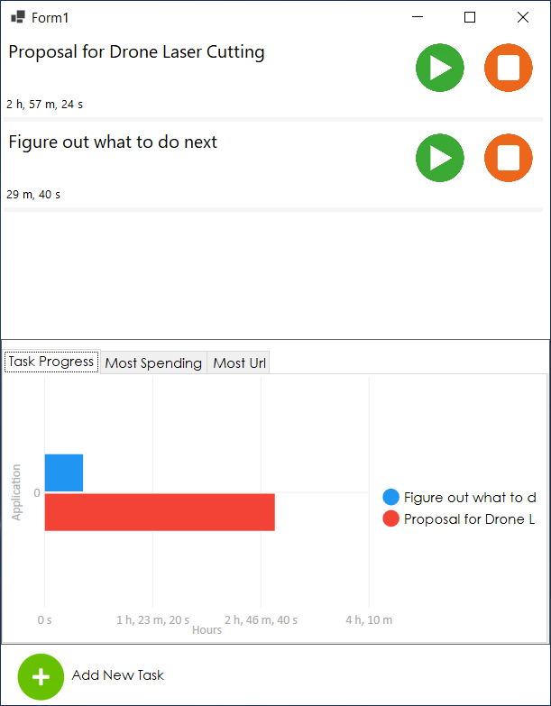
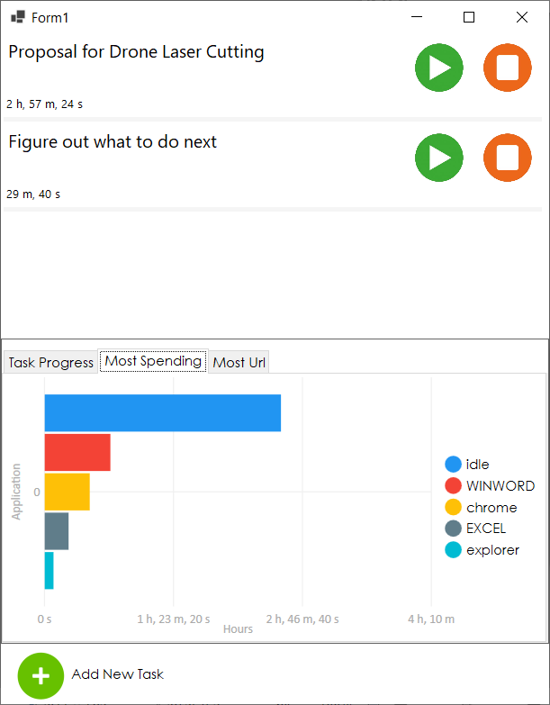
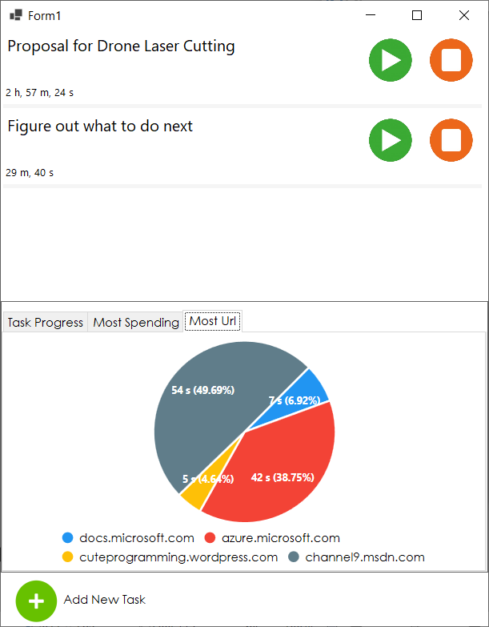

# Produktif Desktop Application
## CI Status

## Introduction
This is a small scale time tracking application (like Rescue Time, etc.) use to record what are you doing on your desktop.
The full control is stills your, no worry about the privacy.
The objective is to keep track, and you can use the information record for your own benefit.

## Features
- Record an active windows
- Record browsing history
- Task list with a timer
- Notification pop out when you idle.
- You need to tell what you are doing. Even though you are doing nothing.

## Inital Screenshot

